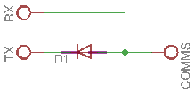
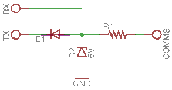
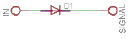

# AccentaG4
Virtual keypad for Honeywell Security Accenta G4 panel.

## Introduction
Accenta G4 is a simple, reliable, affordable intruder alarm panel made by Honeywell Security.

It works very well for residential use but, clearly, it’s not designed for extension. You cannot expand zones, you can’t operate it remotely with your smartphone, it doesn’t expose a standard serial interface to play with.

Recently, I started dreaming of a more sophisticated panel, and after thinking of a possible upgrade, I decided to hack mine.

After a bit of googling, I found a blog with a couple of interesting posts ([this](https://inmachinablog.wordpress.com/2015/11/04/accenta-alarm-keypad-protocol/) and [this](https://inmachinablog.wordpress.com/2015/11/03/decoding-the-alarm-keypad-protocol/)) providing useful background on the protocol and signalling used on the keypad bus, along with a description of the messages exchanged between the keypad and the panel.

## Keypad bus

The keypads (in [LED](https://www.security.honeywell.com/uk/products/intruder/control-panels/gen4/462382.html) and [LCD](https://www.security.honeywell.com/uk/products/intruder/control-panels/gen4/462383.html) variants) communicate with the panel over a single wire (half-duplex, shared bus) using TTL levels (+5v low, 0v high). A quick analysis with the logic analyzer revealed a slightly unusual protocol: RS-232 with 8 bit of data, *mark/space parity* and 1 stop bit or, if you prefer, *9 bit* of data and 1 stop bit, which is the same. In fact, considering bits are sent LSB first (little-endian), the parity bit is just the 9th bit of data.

Any message is sent over the bus with mark parity on the first byte and space parity on the remaining bytes.

## Messaging protocol

Luckily, all communication between panel and keypads is not encrypted nor obfuscated. In fact, the protocol is fairly straightforward.
Any message consists of a single byte command, one or more bytes of data and a one-byte checksum of all the preceding bytes.
Messages are not terminated.
```
<command> <data> [<data>...] <checksum>
```
### Messages sent by the keypad

Apparently, the keypad sends just one type of command over the bus:
```
K <keycode> <checksum>
```
The “K” character, being the first byte of the message, has mark parity.

\<keycode\> is the code representing a physical or virtual (key combination) button on the keypad:

| code | ASCII | type     | button  |
| ---- | :---: | -------- | :-----: |
| 0x30 | 0     | physical | 0       |
| 0x31 | 1     | physical | 1       |
| 0x32 | 2     | physical | 2       |
| 0x33 | 3     | physical | 3       |
| 0x34 | 4     | physical | 4       |
| 0x35 | 5     | physical | 5       |
| 0x36 | 6     | physical | 6       |
| 0x37 | 7     | physical | 7       |
| 0x38 | 8     | physical | 8       |
| 0x39 | 9     | physical | 9       |
| 0x3a | :     | physical | chime   |
| 0x3b | ;     | physical | omit    |
| 0x3c | <     | physical | cancel  |
| 0x3d | =     | physical | program |
| 0x3e | >     | physical | confirm |
| 0x3f | ?     | physical | select  |
| 0xaa | n/a   | virtual  | panic   |

### Messages sent by the panel

The panel sends out one or more messages whenever it needs to update the status displayed on the keypads. Messages of a given type are sent only if they differ from the previous message of the same type.

Please note some responses are sent exclusively as audible tones, delivered as analogue signals via a separate keypad bus wire labeled *SOUNDS*.

#### Messages for the LED keypad (P)

Whenever the status of at least one of the LEDs needs to be updated, a new message is sent.
Each message is a *full* representation of all the LEDs on the keypad.
```
P <zone info> <general info> <checksum>
```
The “P” character, being the first byte of the message, has mark parity.

\<zone info\> is a byte where each bit represents one zone LED:

| bit | LED |
| :-: | --- |
| 0   | zone 1 |
| 1   | zone 2 |
| 2   | zone 3 |
| 3   | zone 4 |
| 4   | zone 5 |
| 5   | zone 6 |
| 6   | zone 7 |
| 7   | zone 8 |

\<general info\> is a byte encoded like follows:

| bit | LED |
| :-: | --- |
| 0   | system unset |
| 1   | tamper |
| 2   | SOS |
| 3   | power |
| 4   | not used? |
| 5   | not used? |
| 6   | not used? |
| 7   | not used? |

#### Messages for the LCD keypad (L)

Whenever the text displayed on the LCD needs to be updated a new message is sent:
```
L <lenght> <LCD data> <checksum>
```
The “L” character, being the first byte of the message, has mark parity.

Lenght information is necessary, as messages are not terminated and size is not fixed, thus the receiver needs to know the message size upfront.

LCD data is a sequence of bytes, either printable (ASCII) or control codes, mostly for managing the cursor:

| code | function |
| ---- | -------- |
| 0x04 | cursor position |
| 0x05 | hide cursor |
| 0x06 | show cursor |
| 0x07 | move cursor right |
| 0x0a | newline |
| 0x0c | clear |
| 0x10 | unknown |
| 0x16 | unknown | 

Cursor position is determined by the subsequent byte:

| position | coordinates |
| -------- | ----------- |
| 0x80 to 0x8f | top row, column 1 to 16 |
| 0xc0 to 0xcf | bottom row, column 1 to 16 |

I believe the LCD keypad consumes "P" messages as well, as information regarding the status of the *power* and *day* LEDs doesn't seem to be show up anywhere in "L" messages.

## To parity or not to parity…

As said, in little-endian, 8-bit with parity and 9-bit without parity are equivalent.

In particular, 8-bit with mark parity is equivalent to 9-bit without parity when the 8-bit character is *OR*ed with 0x100.

So, it’s perfectly equivalent to forget about parity and simply think of alternate codes for the head of the message, with the 9th (or parity) bit set to 1:

| command | keycode | 9-bit code |
| :-----: | :-----: | :--------: |
| K       | 0x4b    | 0x14b      |
| L       | 0x4c    | 0x14c      |
| P       | 0x50    | 0x150      |

No matter how you look at it, having the 9th bit set exclusively for the head of the message is quite convenient, as it makes the code at the receiving end simpler and more robust. In fact it's possible to detect the head of the message without any ambiguity.

## Hardware signals

Keypad bus aside, the panel board exposes also a few output signals representing the general status, for use with a digital communicator or a speech dialer. They are labelled as follows:

- FIRE (fire)
- PA (panic)
- INT (intruder)
- SET (alarm set)
- ABORT (alarm aborted)

Signals are held at +13v and fall to 0v when active.
They are absolutely crucial for this project as some critical alert conditions (like *intruder* or *PA*) are not reflected in LED or LCD status.

## The project

The objective of this project is to build a keypad emulator running in a standard browser.

## Hardware

### Arduino Yún

The circuit is based on [Arduino](https://www.arduino.cc/), a well-known opensource platform providing all the features needed for this project: it's powerful, it's easy to program, it can handle multiple serial ports (with some limitations), it’s very well documented and community support is great.

The variant of Arduino chosen for this project is [Arduino Yún](https://www.arduino.cc/en/Main/ArduinoBoardYun), which combines an ATmega32u4 MCU (same as Arduino Leonardo) with an Atheros AR9331 MPU running [OpenWRT](https://openwrt.org/) (MPU), communicating via a serial port (*Serial1* on MCU, */dev/ttyATH0* on MPU).

#### MCU (Arduino)

The MCU is responsible for the following tasks:

- monitor panel hardware signals (PA, INT, SET, ABORT) and transmit updates over the serial interface
- monitor the keypad bus for incoming messages and transmit updates over the serial interface
- monitor the serial interface for "virtual keypresses" and transmit emulated keypad messages over the keypad bus

Arduino code is written in C/C++ and it's built around the [SoftwareSerial9](https://github.com/edreanernst/SoftwareSerial9) library, capable of sending and receiving 9-bit messages, and [QueueArray](http://playground.arduino.cc/Code/QueueArray), a FIFO library used for enqueuing outgoing commands.

**WARNING**: the [original version by addible](https://github.com/addibble/SoftwareSerial9) contains a bug in the recv() method, fixed by [edreanernst](https://github.com/edreanernst) in the forked version used in this project.

#### MPU (OpenWRT)

The MPU is responsible for the following tasks:

- expose a HTTP server for serving the web application
- expose a websockets server (used by the web application)
- accept and keep track of websockets connections
- monitor the serial interface for incoming messages from the panel and forward to connected websockets clients
- monitor the websockets clients for incoming messages and forward to serial interface
- send email notifications for critical events

Server-side code is written in Javascript and runs under NodeJS (v.0.10.33), with the help of the additional modules [node-serialport (v.1.4.6)](https://github.com/EmergingTechnologyAdvisors/node-serialport/tree/v1.4.6) and [node-ws (v.0.4.32)](https://github.com/websockets/ws/tree/0.4.32).

Client-side code is a HTML5/CSS3/Javascript application running in the browser.

### Custom hardware

Interfacing the panel with Arduino is pretty simple.

In fact, two digital I/O pins and a diode is all you need for connecting the single-wire keypad bus to distinct RX and TX ports.



An additional resistor and a zener diode can help limiting voltage and current across Arduino's I/O pins.



Panel signals (SET, ABORT, INT, PA, FIRE) can either source or sink current. If Arduino's input is configured as INPUT_PULLUP, a diode is enough to pull the input down to LOW logical level when the corresponding panel output is active (LOW).



However, the keypad bus is quite exposed and might be tampered with or be subject to interferences potentially harmful to Arduino. For this reasons, an opto-isolated design it's a much safer choice as it provides full electrical isolation between Arduino and the panel itself.

 keypad bus and panel signals interface")

The circuit is designed to keep the opto-isolator LEDs off during standby, to maximize their life expectancy. Here is a short description of the resistors:

- R1 sets the current for the transmitting opto-isolator LED
- R2 limits the current into the opto-isolator transistor
- R3 sets the stand-by value of the receiver to logical zero (pull-up)
- R4 sets the current for the receiving opto-isolator LED
- R5 sets the base saturation current for T2
- R6 sets the base saturation current for T1

TO BE CONTINUED...

